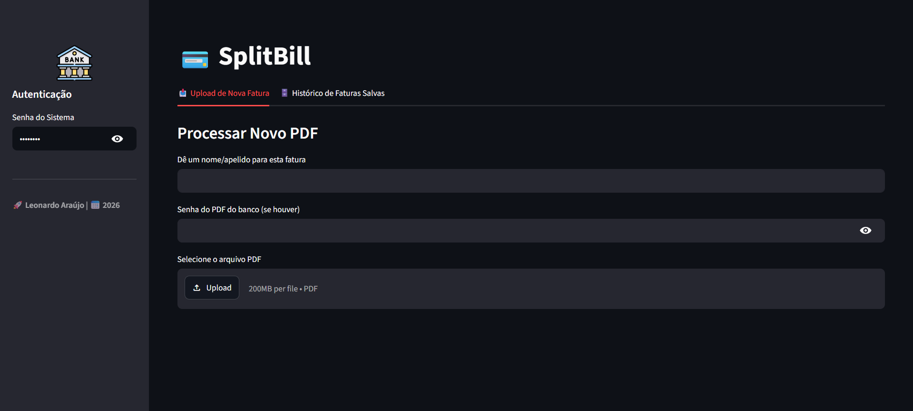

# 💳 SplitBill - Divisor Automático de Faturas

O **SplitBill** é uma aplicação web desenvolvida em Python para automatizar, gerenciar e ratear despesas de faturas de cartão de crédito. Através da leitura inteligente de PDFs bancários, o sistema extrai as transações, permite a divisão fracionada entre múltiplas pessoas e gera um link de acesso para preenchimento colaborativo.

## 🖼️ Preview


## ✨ Funcionalidades Principais
* **Extração Inteligente:** Leitura automática de PDFs bancários (Nubank, Inter, etc.) com filtro automático para ignorar pagamentos e créditos.
* **Rateio Dinâmico:** Divida o valor de qualquer compra entre quantas pessoas quiser apenas usando vírgulas nos nomes (Ex: `Leo, João, Maria`).
* **Banco de Dados Local:** Utiliza SQLite para manter o histórico de faturas e o rateio das pessoas salvo permanentemente.
* **Gestão Colaborativa:** Gera um link único para que outras pessoas acessem a fatura, preencham seus nomes e o sistema atualize o fechamento em tempo real.

## 🚀 Como instalar e rodar
1. Clone o repositório:
   ```bash
   git clone [https://github.com/snowdev-git/splitbill.git](https://github.com/snowdev-git/splitbill.git)